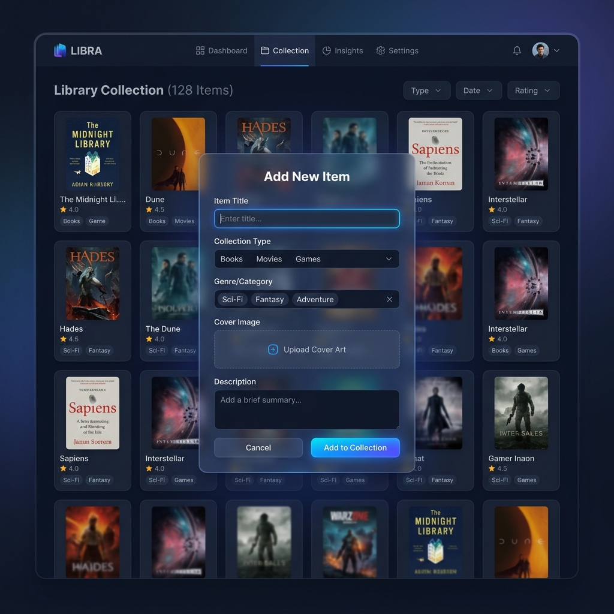

<div align="center">

# 📚 Digital Library Manager

**A premium, dark-mode personal collection manager built with Python, Flask, and Vanilla JS.**

[](https://www.python.org/)
[](https://flask.palletsprojects.com/)
[](https://www.mysql.com/)

</div>

---

## ✨ Overview

The Digital Library Manager is a lightweight but beautifully designed web application that allows you to keep track of your personal collections. Whether it's books, movies, video games, or music, this app lets you log and rate your items with a sleek, distraction-free interface.

### 🖼️ Interface Preview

<div align="center">
  
</div>

## 🚀 Features

- **Premium Aesthetics:** A carefully crafted dark mode UI utilizing modern glassmorphism (frosted glass) effects.
- **Dynamic Interactions:** Smooth hover states, micro-animations, and responsive layouts that look great on any screen.
- **RESTful API:** A clean Python Flask backend handling CRUD (Create, Read, Update, Delete) operations.
- **Automatic Database Setup:** On startup, the application will automatically create the required MySQL database and tables if they do not exist.
- **Zero-Build Frontend:** Pure HTML, CSS, and Vanilla JavaScript—no complex build tools like Webpack or Node.js required.

## 🛠️ Technology Stack

- **Backend:** Python, Flask, Flask-CORS
- **Database:** MySQL Server (`mysql-connector-python`)
- **Frontend:** HTML5, Vanilla CSS3, Vanilla JavaScript

## ⚙️ Local Setup & Installation

### Prerequisites
- [Python 3.x](https://www.python.org/) installed
- [MySQL Server](https://dev.mysql.com/downloads/installer/) installed and running locally

### 1. Clone the Repository
```bash
git clone https://github.com/goutham-hari/digital-library.git
cd digital-library
```

### 2. Install Dependencies
Install the required Python packages using `pip`:
```bash
pip install flask mysql-connector-python flask-cors
```

### 3. Configure Database
Open `app.py` and navigate to the `DB_CONFIG` dictionary (around line 11). Update the `password` field with your local MySQL root password:
```python
DB_CONFIG = {
    'host': 'localhost',
    'user': 'root',
    'password': 'YOUR_PASSWORD_HERE', # Update this
    'database': 'digital_library'
}
```

### 4. Run the Application
Start the Flask server:
```bash
python app.py
```
*You should see a message in the terminal saying `Database initialized successfully.`*

### 5. Access the App
Open your web browser and navigate to:
**http://localhost:3000**

---

<div align="center">
  Made with ❤️ by goutham-hari
</div>
